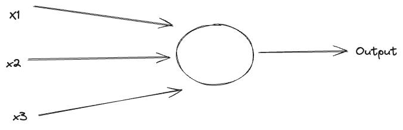
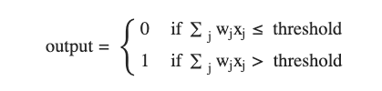

Before Diving deep into neural networks its a suggestion to revise linear algebra.

# Linear Algebra

## Vectors

Resource : [Good Youtube Playlist](https://www.youtube.com/watch?v=fNk_zzaMoSs&list=PLZHQObOWTQDPD3MizzM2xVFitgF8hE_ab)

# Neural Networks Fundamentals

The most common neuron model userd today is one called the sigmoid neuron, but before understanding that. I will try to understand what are perceptrons and what gaps that they had which lead to people learning sigmoid neurons?

Perceptrons were [developed](http://books.google.ca/books/about/Principles_of_neurodynamics.html?id=7FhRAAAAMAAJ) in the 1950s and 1960s by the scientist [Frank Rosenblatt](http://en.wikipedia.org/wiki/Frank_Rosenblatt), inspired by earlier [work](http://scholar.google.ca/scholar?cluster=4035975255085082870) by [Warren McCulloch](http://en.wikipedia.org/wiki/Warren_McCulloch) and [Walter Pitts](http://en.wikipedia.org/wiki/Walter_Pitts).

A perceptron takes a binary inputs x1,x2,… and produces a single binary output.

In the example shown the perceptron has three inputs, x1,x2,x3 In general it could have more or fewer inputs. The neuron’s output is determined by weather the sum of the inputs is greater then sun threshold value.

x1+x2+x3 < threshold then the output will be 0 otherwise it will be 1. But in this example the weight of each input is 1.

### What do we mean by weight?

A way you can think about the perceptron is that it's a device that makes decisions by weighing up evidence. Let us understand this with an example:

Suppose you are on a weight loss journey and someone just put a box of sweets in front of you. Now you may want to decide weather of not to eat the sweets based on the following 3 factors:

1. Did complete your calorie goals for the day?
2. Does your favourite sweet is part of the sweets which are offered?
3. Are the sweets present low in calories?

We can represent these factors by corresponding binary variables x1,x2 and x3. For instance if you like the sweet we will have x1=1 if you don’t like it x1= . Similarly for others as well we will have x2=1 if your favourite sweet is present and x2=0 if its not there, similar with x3 as well.

Now suppose you are a person who absolutely loves sweets and you are happy to eat even if it has your favourite sweet present even if its not low calorie or you have completed the calorie limit for the day. One way to do this is choose a weight W2 as 6 and W1 and W3 as 2 respectively. The larger value of W2 indicates that the type of sweet matters a lot to you, much more than the other 2 weights. Finally suppose you choose the threshold as 5 for the perceptron network.

With these choices, the perceptron implements the desired decision-making model, outputting 1 whenever the sweet present is favourite, and 0 whenever its not. It makes no difference to the output whether you have hit the calorie limit or the sweets present are low calorie.

From this example we understand that the neuron’s output is determined by weighted sum

∑j wjxj is less than or greater than some _threshold value_. Just like the weights, the threshold is a real number which is a parameter of the neuron. To put it in more precise algebraic terms:

## Sigmoid Neurons

Let us now try to understand why we needed signmoid neurons. Suppose we have a network of perceptrons to solve a specific set of problem. Let us say we are uploading and image to read handwritten letters. We want the network to learn weights and biases so that the output from the network correctly classifies the letter. Suppose we want the network to understand the difference b/w 'd' and 'b',we observe that the network in unable to recognise this and we make a slight change in the weight so that instead of classifying the image as a 'b' it classifies the image as a 'd'. Similarlarly we would want to change the weight and biases in other cases as well.
![[perceptron_weight_change.png]]

The problem is that this isn't what happens when our network contains perceptrons. In fact, a small change in the weights or bias of any single perceptron in the network can sometimes cause the output of that perceptron to completely flip, say from 0 to 1. That flip may then cause the behaviour of the rest of the network to completely change in some very complicated way. So while your "b" might now be classified correctly, the behaviour of the network on all the other images is likely to have completely changed in some hard-to-control way. That makes it difficult to see how to gradually modify the weights and biases so that the network gets closer to the desired behaviour. Perhaps there's some clever way of getting around this problem. But it's not immediately obvious how we can get a network of perceptrons to learn.

We fix this by introducing a new type of neuron called singmoid neuron. They are similar to perceptrons but they can be modified in such as way that small changes in their weights and biases cause only a small change in their output.

In case of sigmoid neuron the inputs will we x1,x2,x3, but instead of being just 0 or 1, these inputs can also take any values between 0 and 1. So for instance, 0.138 is a valid input for a sigmoid neuron. Similar to perceptron, the sigmoid neuron has weights for each input, w1,w2,w3... and an overall bias b.

Another major difference is that instead of output just being 1 or 0 it, its σ(w⋅x+b) where σ is called the sigmoid function which is defined by:
![[sigmoid_function.png]](sigmoid_function.png)

The output of the sigmoid function with weights would look like this :

Now **to visualize this function**, we can take some values of x and y and plot it to see what it looks like, for example in the below case, we are plotting (‘**wx + b**’) on the x-axis and ‘y’ value on the y-axis.
![[sigmoid_graph.png]](sigmoid_graph.png)

If ‘**wx + b**’ is 0, then the equation(**y**) is reduced to:

![[Screenshot 2024-10-06 at 2.13.01 PM.png]](Screenshot 2024-10-06 at 2.13.01 PM.png)

Let’s try some other value:

![[Screenshot 2024-10-06 at 2.14.14 PM.png]](Screenshot 2024-10-06 at 2.14.14 PM.png)

This example is taken from the blog : https://prvnk10.medium.com/sigmoid-neuron-ad0ec6f9a3e2

To understand the similarity to the perceptron model, suppose z≡w⋅x+bz≡w⋅x+b is a large positive number. Then e−z≈0 and so σ(z)≈1 In other words, when z=w⋅x+b is large and positive, the output from the sigmoid neuron is approximately 1, just as it would have been for a perceptron. Suppose on the other hand that z=w⋅x+b is very negative. Then e−z→∞ and σ(z)≈0. So when z=w⋅x+b is very negative, the behaviour of a sigmoid neuron also closely approximates a perceptron. It's only when w⋅x+b is of modest size that there's much deviation from the perceptron model

So the sigmoid function looks something like this:

![[sigmoid_function_graph.png]](sigmoid_function_graph.png)

## Neural Networks

![[neural_network_architecture.png]](neural_network_architecture.png)

In the neural network architecture, the leftmost layer is called the input layer and the rightmost is called the output layer. The middle layers are called hidden layers.

The design of the input and output layers in a network is often straightforward. For example, suppose we're trying to determine whether a handwritten image depicts a "9" or not. A natural way to design the network is to encode the intensities of the image pixels into the input neurons. If the image is a 64 by 64 greyscale image, then we'd have 4,096=64×64 input neurons, with the intensities scaled appropriately between 0 and 1. The output layer will contain just a single neuron, with output values of less than 0.5 indicating "input image is not a 9", and values greater than 0.5 indicating "input image is a 9".

| Resources   |                                                                                                                  |
| ----------- | ---------------------------------------------------------------------------------------------------------------- |
| Medium Blog | [https://prvnk10.medium.com/sigmoid-neuron-ad0ec6f9a3e2](https://prvnk10.medium.com/sigmoid-neuron-ad0ec6f9a3e2) |
| Website     | http://neuralnetworksanddeeplearning.com/                                                                        |
| Youtube     | https://www.youtube.com/@3blue1brown                                                                             |
